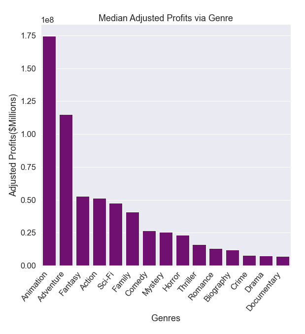
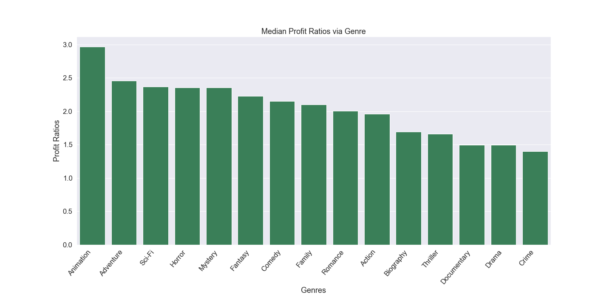
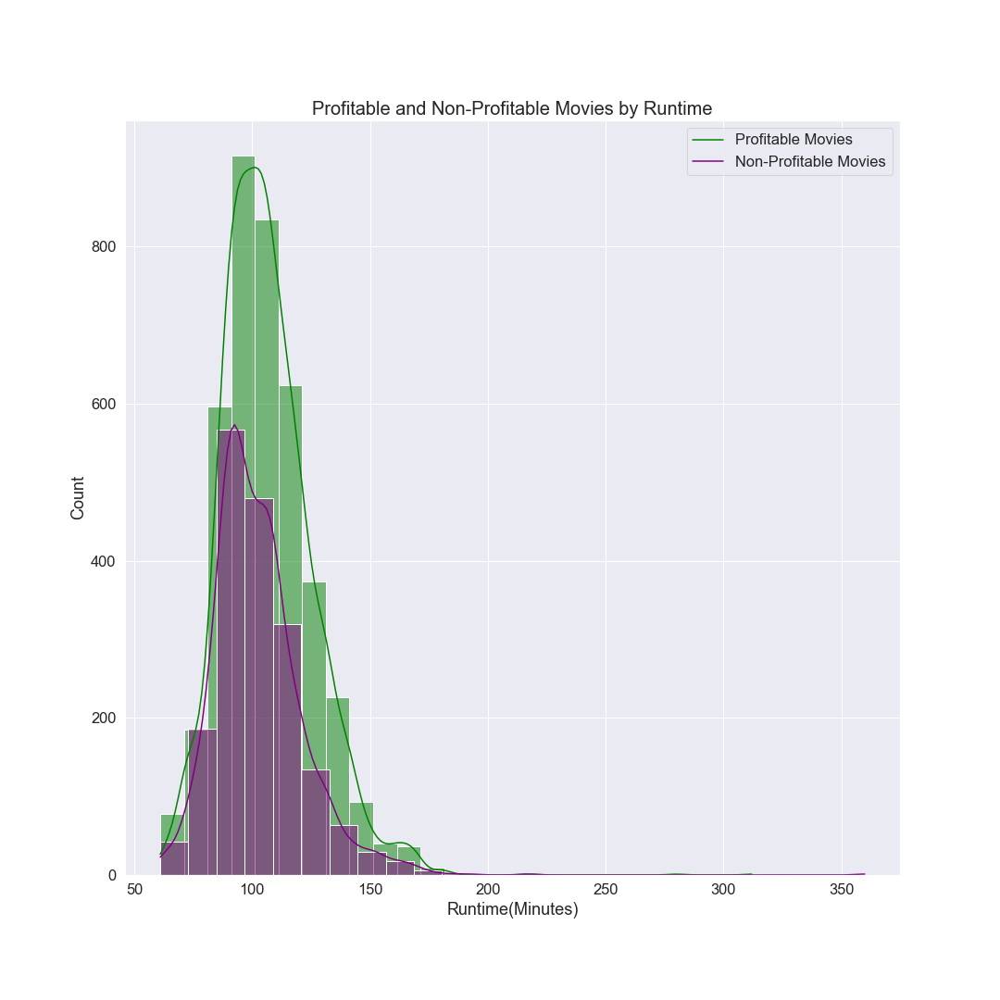
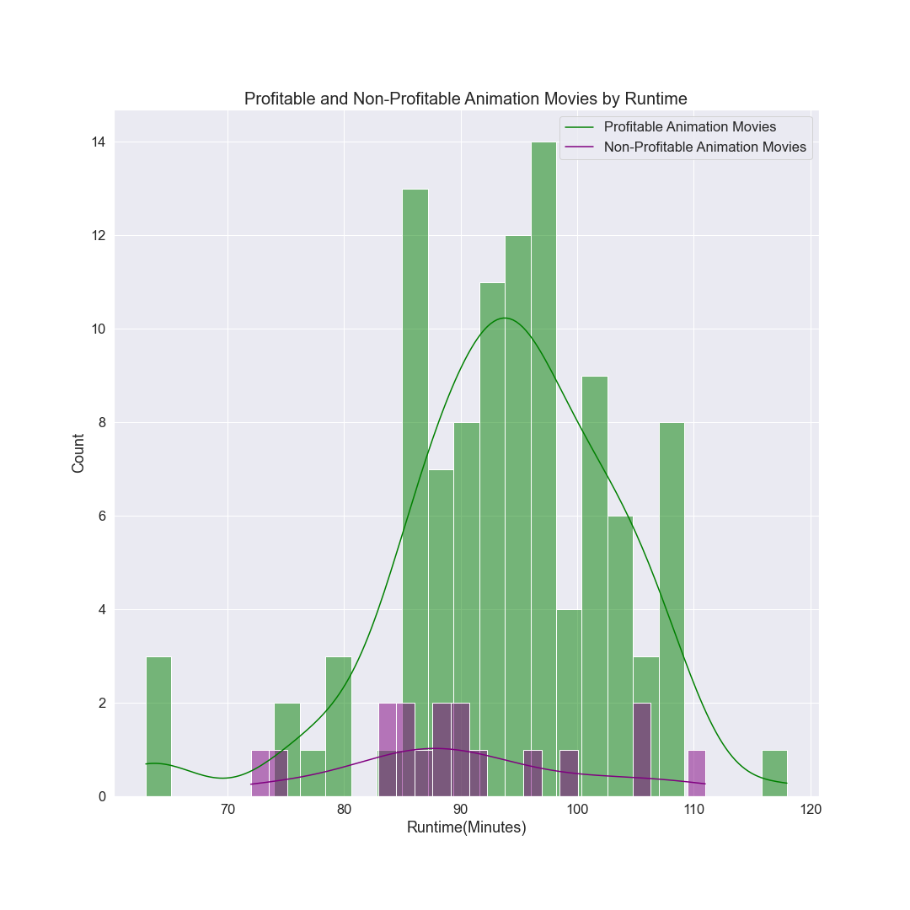

# Microsoft Movie Analysis

**Author**: Sierra Mecalo-Schwigen

## Overview

With the growing success of the movie industry, Microsoft has made the decision to start their own movie studio. In order to assist them in determining which genre of movie to select for their first film, analysis of movie production data must be completed. The analysis of data from IMDB and The Numbers will be used to determine the success of movies in dollars spent vs. dollars earned. Results of the analysis can be used to strategically select which movie genre Microsoft should consider creating to optimize potential profits.

## Business Problem

This analysis will be examining which movie genre provides the highest profit potential. The guiding questions to be used are:
* What is the highest grossing genres?
* Which of those genres provides the highest return on investment?
* Is there a correlation between movie run time and ROl?

Using the results of the data found while exploring the above questions, three business recommendations will be provided to Microsoft for consideration when selecting their first film production.

## Data

Scraped data from IMDB and The Numbers will be used for this analysis. These are reputable databases that provide information on the movie industry. The data scraped from IMDB includes movie title, runtime in minutes, and movie genre. The data scraped from The Numbers includes movie title, production budget, domestic gross revenue, and worldwide gross revenue. The Python library CPI will also be used to adjust for inflation using the Consumer Price Index.
***
Variables that will be explored include genres, production budget, release year, runtime minutes, and worldwide gross. 

Variables to be added for exploration are inflation adjusted production budget and worldwide gross, profit, and roi.

## Methods

Analysis started by merging the datasets on the Primary Title and Movie columns. Then unnecessary columns were dropped from the dataframe. The production budget and worldwide gross columns were converted to float data types. For entries containing multipe genres, each entry was exploded into individual entries for each genre specified. Genres with less than 100 movies were then dropped. The dataframe was checked for movies missing information in the genres and worldwide gross columns, and those entries were removed from the dataframe. Columns were then added to determine profit and return on investment. The production budget, profit, and worldwide gross columns were adjusted for inflation to 2021.

***
Additional data cleaning was conducted throughout the analysis as the business problems called for refined datasets.
* Initial dataframe contained 6740 entries
* Dataframe excluding non-profitable movies contained 4549 entries
* Dataframe of profitable movies after removing missing runtime data contained 4261 entries
* Dataframe only including profitable Animation genre movies contained 106 entries


## Business Problem 1: Highest Grossing Genre



The median profits via genre graph shows animation, fantasy, adventure, and sci-fi making the most profit. Based solely on profits, Microsoft would want to chose either an animated or adventure film as their first choice.

***
## Business Problem 2: Highest ROI



This graph shows animation coming in first place with profit ration of about 3:1, adventure in second place at 2.5:1, and sci-fi in third with 2.4:1. It seems that between profit and return on investment, animation would be the best choice for Microsoft's first movie.

***
## Business Problem 3: Runtime



The above graph shows a right skewed distribution. Runtimes of 90 to 120 minutes for both profitable and non-profitable movies appear to be the most successful. It would be helpful to look strictly at Animation movies, as those have showen to provide the highest profit and return on investment.



Looking strictly at Animation movies, the above graph displays a slightly left-skewed distribution. Based on the above graph, a recommendation of movie runtimes between 90 to 98 minutes would be made.
***

## Conclusions

Based on the provided data analysis, the following is recommended:
* For maximum potential profit: Animation or Adventure genres
* For maximum potential return on investment: Animation genre
* Ideal runtime in minutes: 90-98

Microsoft Movie Studio is just beginning so further research may be necessary. This analysis aims to provide Microsoft with strong business recommendations for their first production but it does not cover all potential areas of interests. Further suggested analysis would include optimal release month, success rates of various directors and actors, and impact on movie success by critic reviews.
***

## For More Information

Please review our full analysis in [our Jupyter Notebook](./dsc-phase1-project-template.ipynb) or our [presentation](./DS_Phase1_Project_Presentation.pdf).

For any additional questions, please contact **Sierra Mecalo-Schwigen, sierra.m.schwigen@icloud.com**

## Repository Structure

```
├── README.md                           <- The top-level README for reviewers of this project
├── dsc-phase1-project-template.ipynb   <- Narrative documentation of analysis in Jupyter notebook
├── DS_Phase1_Project_Presentation.pdf         <- PDF version of project presentation
├── data                                <- Both sourced externally and generated from code
└── images                              <- Both sourced externally and generated from code
```
